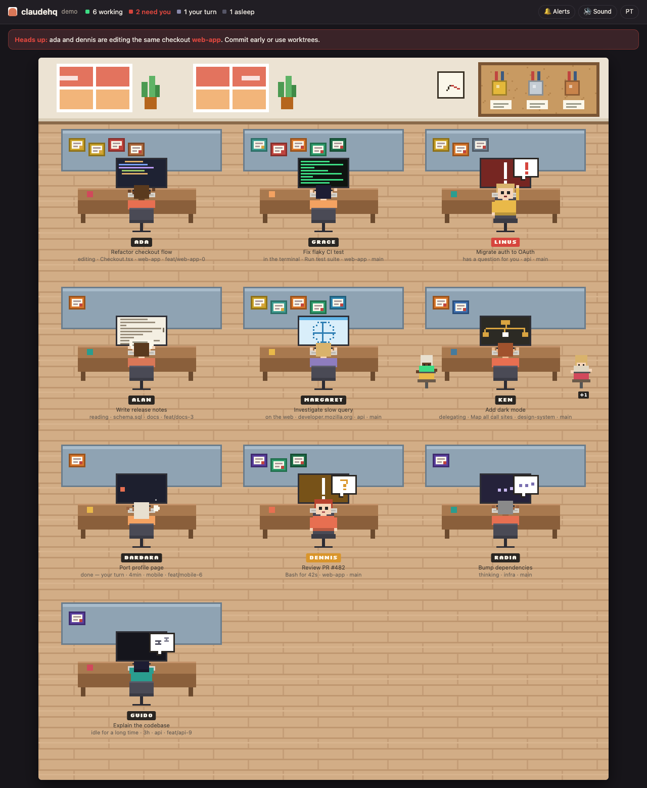

# claudehq

**Um escritório em pixel art onde cada sessão do Claude Code é uma pessoa numa mesa.** Você vê quem está trabalhando, quem precisa de você e quem está editando o mesmo clone que outra sessão.



*[English below](#english)*

## Por que existe

Quem roda várias sessões do Claude Code ao mesmo tempo perde de vista qual delas parou para perguntar alguma coisa, qual terminou e qual está mexendo no mesmo repositório que outra. O claudehq junta tudo numa tela só, que dá vontade de deixar aberta.

## Usar

```bash
npx claudehq            # abre http://127.0.0.1:4777 no navegador
npx claudehq --demo     # escritório de mentira, com todos os estados
npx claudehq --private  # esconde títulos, pastas e arquivos (para compartilhar a tela)
```

Requer Node 18+ e não tem nenhuma dependência.

### Como plugin do Claude Code

```
/plugin marketplace add <seu-usuario>/claudehq
/plugin install claudehq@claudehq
/hq
```

O comando `/hq` sobe o servidor e devolve o link.

## O que aparece

| No escritório | Significa |
|---|---|
| Monitor com código sendo digitado | editando arquivo (`Edit`, `Write`) |
| Monitor preto com texto verde | rodando comando (`Bash`) |
| Monitor com folha de papel | lendo ou procurando (`Read`, `Grep`, `Glob`) |
| Monitor com globo | na web (`WebFetch`, `WebSearch`, MCP de navegador) |
| Monitor com organograma, mais estagiários nos banquinhos | delegando para subagentes |
| Virada para você, acenando, com balão **!** | fez uma pergunta e espera a sua resposta |
| Virada para você, com balão **?** | ferramenta parada há mais de 6s: ainda rodando **ou** esperando a sua permissão |
| Protetor de tela, com uma caneca fumegante | terminou o turno, é a sua vez |
| Balão **zZ**, monitor desligado | parada há mais de 20 min |
| Divisória piscando em vermelho e faixa no topo | duas sessões editaram o mesmo checkout nos últimos 15 min |

**Certificados na parede:** cada mesa ganha quadros com as skills e os servidores MCP que aquela sessão usou, além de conquistas como *Maratonista*, *Chefe de equipe*, *Memória de elefante* e *Mestre do terminal*. Passe o mouse para ler. O **mural de cortiça** mostra as skills mais usadas na máquina toda.

Clique numa pessoa para ver o repositório, a branch, o modelo, o contexto, as últimas ações, os subagentes e os certificados.

Há avisos opcionais: som e notificação do sistema quando alguém precisa de você ou termina o turno.

## Como funciona (e o que não faz)

- **Só lê, não instala nada.** Usa o que o Claude Code já grava em `~/.claude/`:
  - `sessions/*.json`: as sessões vivas e se cada uma está trabalhando ou parada.
  - `projects/**/<sessão>.jsonl`: o título, a pasta, a branch, as ferramentas e o contexto.
  - `projects/**/<sessão>/subagents/`: os subagentes.
  - `~/.claude.json`: só as chaves `skillUsage`, `pluginUsage` e `mcpServers`.
- **Não usa hooks** e não altera `settings.json`.
- **Não gasta token**: não faz nenhuma chamada a modelo.
- **Não sai da sua máquina**: o servidor escuta só em `127.0.0.1`, e os ficheiros `*.key` da pasta de sessões nunca são lidos.
- **Limitação honesta:** pelo disco não dá para distinguir "comando demorado" de "esperando permissão". Os dois aparecem como **?**, com o tempo parado.
- Respeita `CLAUDE_CONFIG_DIR`.

## Desenvolver

```bash
npm test        # monta um ~/.claude falso e confere o coletor
npm run demo
node bin/claudehq.js --json   # um retrato do estado, em JSON
```

Estrutura: `src/collect.js` (leitura incremental dos transcritos), `src/server.js` (HTTP + SSE), `public/app.js` (desenho no canvas, sem imagens: tudo é retângulo).

---

## English

**A pixel-art office where every Claude Code session is a person at a desk.** See who's working, who needs you, and who's editing the same checkout as another session.

```bash
npx claudehq            # opens http://127.0.0.1:4777
npx claudehq --demo     # fake office with every state
npx claudehq --private  # hide titles, paths and file names
```

Or as a Claude Code plugin: `/plugin marketplace add <you>/claudehq`, then `/plugin install claudehq@claudehq`, then `/hq`.

- **Read-only, no hooks, no tokens, local only.** It reads what Claude Code already writes under `~/.claude/` (`sessions/`, `projects/` transcripts and subagents, plus the usage counters in `~/.claude.json`). It never reads the `*.key` files and binds to `127.0.0.1`.
- **States:** editing, terminal, reading, web, delegating (with interns for subagents), has a question for you (**!**), tool stalled for more than 6s (**?**: still running *or* waiting for permission; the disk can't tell which), done/your turn, asleep.
- **Certificates:** each desk's partition shows the skills and MCP servers that session used, plus achievements. The cork board shows your most-used skills.
- **Clash alert:** two sessions that edited the same checkout in the last 15 minutes flash red.

Node 18+, zero dependencies, MIT.
