<p align="center">
  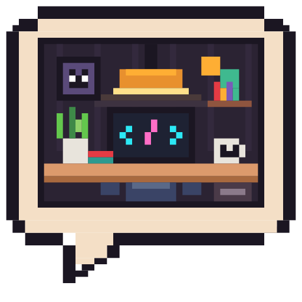
</p>

<h1 align="center">coworking-agents</h1>

<p align="center"><b>A live pixel-art office for your AI coding agents.</b><br>Claude Code · Codex · zero dependencies · local only</p>

**A live pixel-art office for your AI coding agents.** Every open session (Claude Code, Codex, …) becomes a person at a desk. At a glance you see who is working, who needs you (and what they are asking), whose turn it is, and which sessions are editing the same checkout, even across different AIs.

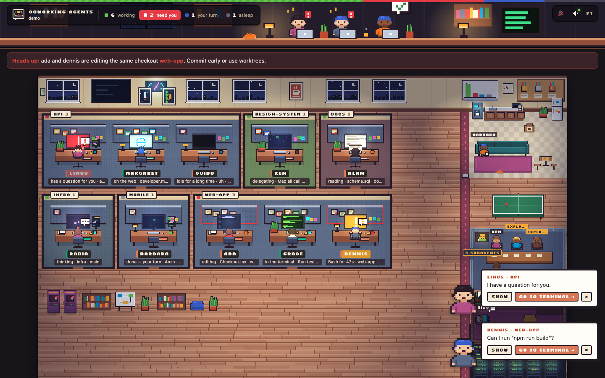

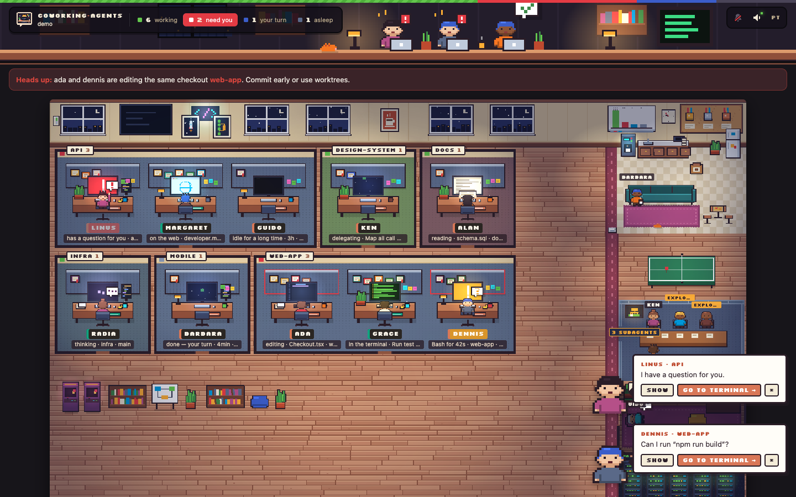

## Tour

| | |
|---|---|
| 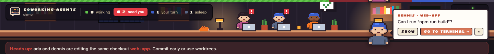 | **Top bar.** One HUD with the counters and the usage meters; the counter below is where agents waiting on you sit (4 per office, **+** slides to the next). |
| 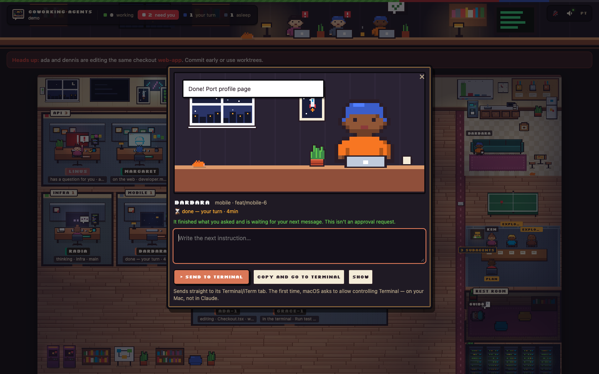 | **Talk.** Click a waiting agent: it says what it wants at its desk. Reply right there (sent to its Terminal/iTerm tab) or jump to the terminal. |
| 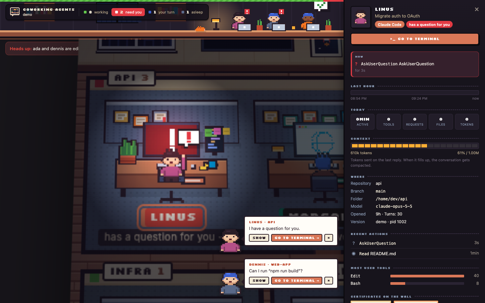 | **Camera.** Click an agent and the camera flies in to its desk with a spotlight; the side panel shows everything about the session. |
| 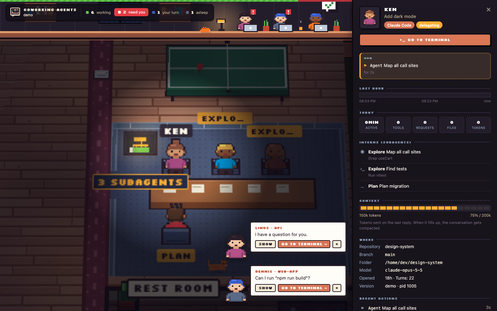 | **Agent panel.** Now, last request and reply, last-hour timeline, today's numbers, tokens, context, files, subagents, certificates. |
| 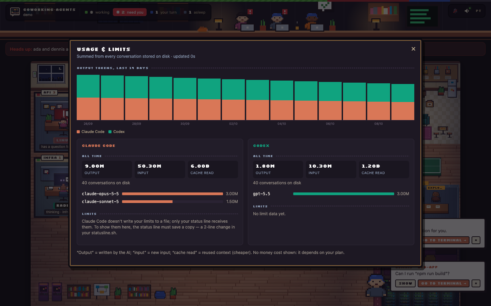 | **Usage report.** Tokens per day for 14 days, all-time totals per AI and per model, rate-limit windows with reset times. |
| 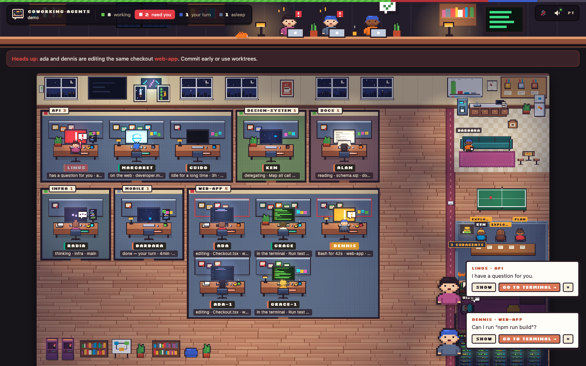 | **Arrivals and departures.** A new session gets its room boarded up and built (planks, dust, caution tape); a closed one walks out and its desk is demolished. |
| 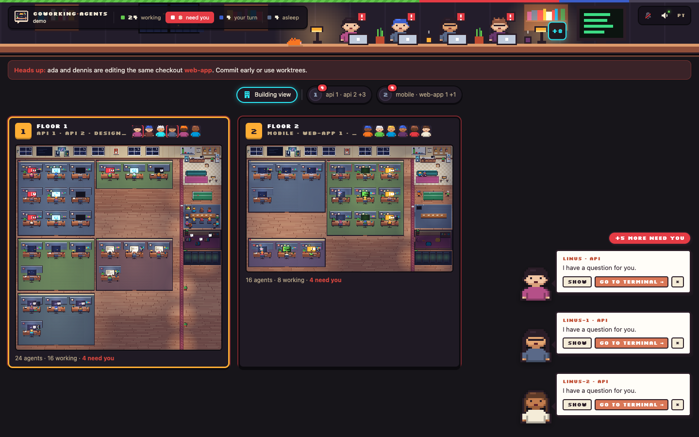 | **Building view.** Many agents? Floors, each a live thumbnail. |
| 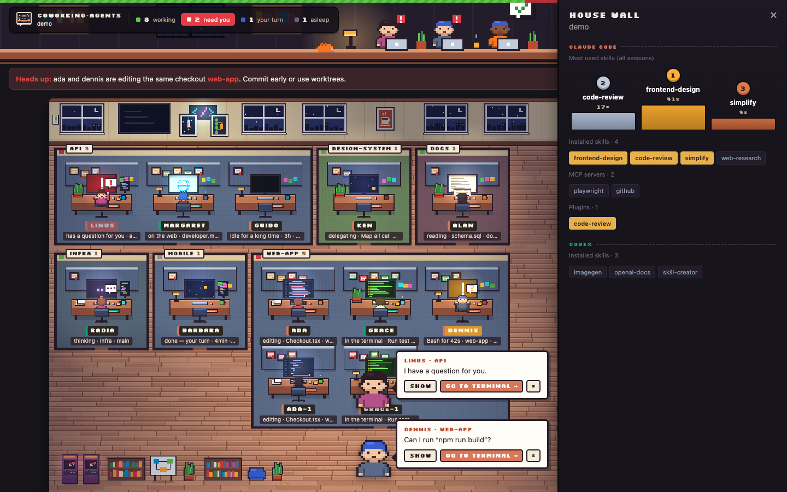 | **House wall.** Podium of the most used skills, installed skills, MCP servers and plugins. |
|  | **Day and night.** Lighting follows your clock; a wall switch turns the ceiling lights on or off; the rest room stays dark. |
| 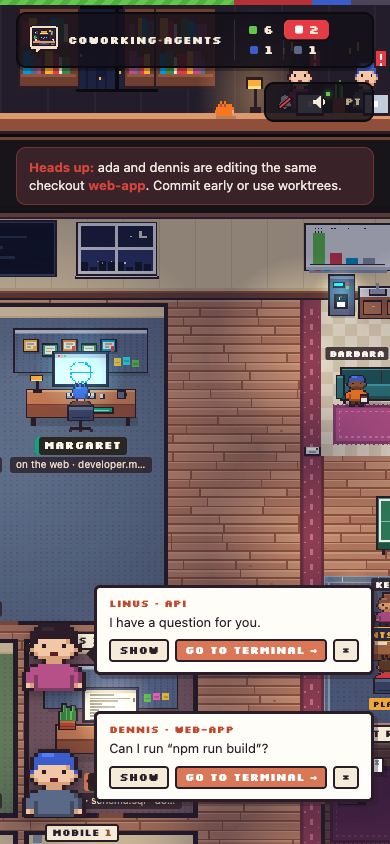 | **Phone.** Works on small screens too. |

## Why

When you run several AI sessions at once, you lose track of which one stopped to ask you something, which one finished, and which two are touching the same repository. coworking-agents puts all of them on one screen that you actually want to leave open.

## Quick start

```bash
npx coworking-agents              # opens http://127.0.0.1:4777 in your browser
npx coworking-agents --demo       # a fake office showing every state (no sessions needed)
npx coworking-agents --private    # hide names, branches, repos, titles and paths (screen sharing)
npx coworking-agents --port 5000  # pick a port (default 4777; falls back to a free one if taken)
npx coworking-agents --no-open    # don't open the browser
npx coworking-agents --json       # print one snapshot of the state as JSON and exit
```

Requires Node 18+. Zero dependencies.

### Access token

The server only answers requests that carry a random per-run token. The CLI prints (and opens) a link like `http://127.0.0.1:4777/?t=…`; on first visit the token becomes an `HttpOnly`, `SameSite=Strict` cookie and the URL is cleaned up. Any other page, or a request without the cookie, gets a "locked" page.

Running `npx coworking-agents` a second time reuses the office that is already running instead of starting another: the link is stored in `~/.config/coworking-agents/session.json` (mode `0600`, readable only by you) and checked with a ping before reuse. `--demo`, `--private` and `--port` always start a fresh server.

### As a Claude Code plugin

```
/plugin marketplace add ChaconLucas/coworking-agents
/plugin install coworking-agents@coworking-agents
/coworking
```

`/coworking` starts the office in the background and replies with the URL. It accepts the same flags, e.g. `/coworking --private`.

## Supported AIs

| AI | What is read | A session counts as open when |
|---|---|---|
| **Claude Code** | `~/.claude/sessions/<pid>.json` (live-session registry) and `~/.claude/projects/**/<id>.jsonl` (transcripts, including subagents) | it is in the official registry and its pid is alive |
| **Codex** (CLI and app) | `~/.codex/sessions/YYYY/MM/DD/*.jsonl` and `session_index.jsonl` (titles) | a Codex process is running and the conversation was touched in the last 3 hours |

`CLAUDE_CONFIG_DIR` and `CODEX_HOME` are respected. The colored nameplate on each desk and the badge border show which AI a person is. Want another AI? See [Adding a new AI source](#adding-a-new-ai-source).

## The floor plan

- **One room per repository.** Each room has its agents' desks, a carpet in the repo's color and a sign with its name. Worktrees of the same repo share the room. A room with more than 9 agents splits into several (`api 1`, `api 2`, …).
- **A shared wing** on the right of every floor:
  - **Kitchen / lounge:** agents whose turn ended walk over for a coffee or a seat on the sofa. When **2 or more** are idle, two of them play **ping-pong**.
  - **Glass meeting room:** agents that are delegating sit here together with their subagents (shown as interns).
  - **Nap corner:** sessions idle for a long time (20+ min) lie down on bean bags.
- **Floors and Building view.** With many rooms the office gains floors, each with its own shared wing. A floor picker appears at the top, and **Building view** shows every floor as a live thumbnail with counts of who is working and who needs you; click one to go there.


## States

| In the office | Meaning |
|---|---|
| Monitor with code being typed | **editing** a file |
| Black monitor with green text | running a command in the **terminal** |
| Monitor with a sheet of paper | **reading** or searching |
| Monitor with a globe | on the **web** |
| Thought bubble with dots | **thinking** (turn open, no tool running) |
| Off to the meeting room with interns | **delegating** to subagents |
| Turned toward you, red **!** bubble | **needs you**: it asked a question; the toast shows the actual question (or "my plan is ready" for plan mode) |
| Turned toward you, amber **?** bubble | **waiting for approval**. For a pending Bash in Claude Code this is measured: if Claude Code spawned the shell for the command, it is running; if not, it is waiting for you. Other stalled tools are judged by the permission mode |
| Hourglass bubble | a tool has been running for more than a minute |
| Walks to the kitchen / lounge | done, **your turn** |
| Lying in the nap corner, **zZ** | **asleep**: idle for 20+ minutes |
| Divider flashing red, banner on top | two sessions, of any AI, edited the same checkout in the last 15 minutes |

Click a person for the side panel: repository, branch, worktree, model, context size, turns, recent actions, subagents, most-used tools and certificates.


## Help toasts

When someone needs you, a toast appears with the **agent's pixel portrait**, its name and repo, and what it wants: the question it asked, the command it wants to run, or the file it wants to edit. Finished turns show a short "Done!" toast. Up to 3 toasts show at once; the rest go behind a "+N more" button.

Each toast has **Show** (switches floor, opens the panel and scrolls to the desk) and **Go to terminal**, which brings the exact Terminal.app or iTerm2 tab running that session to the front by matching its tty (macOS only; other terminal apps such as VS Code, Cursor, Warp, Ghostty, WezTerm, kitty and Alacritty are just activated). For Codex sessions without a known process it opens the Codex app.

Agents away from their desks (kitchen, meeting room, nap corner) carry a name tag over their heads. Optional sound and system notifications can be turned on from the top bar.

## A living office

- **Certificates and achievements:** each desk's partition gets framed certificates for the skills and MCP servers that session used, plus achievements such as *Hundred tools*, *Thousand tools*, *Marathoner* (4h+), *Immortal* (24h+), *Team lead*, *Elephant memory* (500k+ context tokens), *Long talk*, *Terminal master*, *Writer* and *Researcher*. Hover to read them.
- **Whiteboard:** a live bar chart of who is working, needs you, has the turn, or is asleep.
- **Cork board:** skills installed on the machine and the most-used ones, per AI, plus MCP servers and plugins.
- **Day/night lighting:** the light follows your local time (day, dusk, night with monitors and lamps glowing).
- **The office cat** wanders around and naps next to sleeping agents.
- **Languages:** English and Brazilian Portuguese, picked from your browser and switchable in the top bar.

<p align="center"></p>

## Privacy and security

- **Read-only.** No hooks, nothing installed into the AIs, no configuration changed.
- **No tokens spent.** It never calls a model or any network service.
- **Local only.** The server binds to `127.0.0.1`.
- **Host allowlist.** Requests whose `Host` header isn't `127.0.0.1`, `localhost` or `[::1]` are rejected, which blocks DNS-rebinding attacks.
- **Access token.** Every request needs the per-run token cookie (see [Access token](#access-token)). The "Go to terminal" endpoint additionally requires a custom header and a local origin.
- **Strict CSP.** `default-src 'self'`, no frames, no external scripts, fonts or connections.
- **Never reads credentials.** Not Claude Code's `*.key` files, not Codex's `auth.json`. From `~/.claude.json` it reads only `skillUsage`, `pluginUsage` and `mcpServers`.
- **Secrets are masked.** Tokens, passwords, API keys and `Bearer` values inside commands are replaced with `•••` before display.
- **`--private` mode** for screen sharing hides agent names, branches, repo names (replaced by aliases like `repo A`), session titles, paths, file names, questions, skills, MCP names and the host name.

## Limitations

- **Codex has no live-session registry.** "Open" means a Codex process is running and the conversation was touched in the last 3 hours, so a closed Codex chat can linger for a while.
- **Waiting vs. running** is told apart by inspecting processes (`ps`): for Claude Code's Bash it checks whether the command's shell was spawned. When the disk can't tell, the panel says so instead of guessing.
- **"Go to terminal" is macOS only.**

## Adding a new AI source

Each AI is one file in `src/sources/` that exports:

```js
module.exports = {
  id: 'my-ai', label: 'My AI',
  // live sessions: { agent, id, name, pid, kind, version, status: 'busy'|'idle', since, startedAt, cwd, st, subagents }
  sessions(now) { return []; },
  // conversations touched since `since` (midnight), for the daily report: { agent, id, st, title? }
  today(since) { return []; },
  // what the cork board shows
  credentials() { return { topSkills: [], skills: [], mcps: [], plugins: [] }; },
};
```

`st` comes from `incremental()` in `src/util.js`: you write only an `absorb(state, line)` that understands your AI's transcript format and call `track()` for each tool call (and `event()` for turn starts and ends). Then register the file in `SOURCES` in `src/collect.js`, give it a color in `AGENT` in `public/js/palette.js`, and add a case to `test/run.js`.

## Development

```bash
npm test             # builds fake ~/.claude and ~/.codex folders and checks the collector and the server
npm run demo         # the fake office with every state
npm run screenshots  # regenerates docs/*.png from demo mode (needs agent-browser on PATH)
node bin/coworking-agents.js --json   # one snapshot of the state, as JSON
```

The server also exposes `/api/state` (the snapshot, including a per-session timeline and recently edited files) and `/api/report` (today's sessions, active time, tool calls, files and output tokens).

## License

MIT, see [LICENSE](LICENSE). The Silkscreen font is under the SIL Open Font License (`public/fonts/OFL.txt`).
