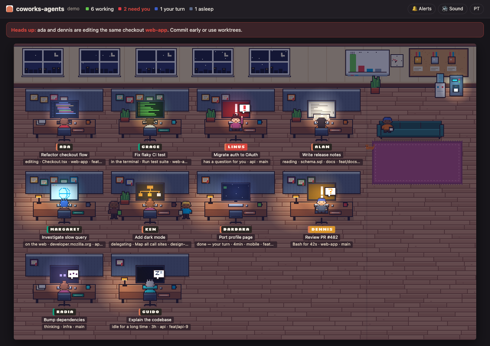

# coworks-agents

**Um coworking em pixel art para as suas IAs de programação.** Cada sessão aberta (Claude Code, Codex, …) vira uma pessoa numa mesa. Você vê quem está trabalhando, quem precisa de você e quem está editando o mesmo clone que outra sessão, mesmo que sejam IAs diferentes.




*[English below](#english)*

## Por que existe

Quem roda várias sessões de IA ao mesmo tempo perde de vista qual delas parou para perguntar alguma coisa, qual terminou e qual está mexendo no mesmo repositório que outra. O coworks-agents junta todas numa tela só, que dá vontade de deixar aberta.

## Usar

```bash
npx coworks-agents            # abre http://127.0.0.1:4777 no navegador
npx coworks-agents --demo     # escritório de mentira, com todos os estados
npx coworks-agents --private  # esconde títulos, pastas e arquivos (para compartilhar a tela)
```

Requer Node 18+ e não tem nenhuma dependência.

### Como plugin do Claude Code

```
/plugin marketplace add <seu-usuario>/coworks-agents
/plugin install coworks-agents@coworks-agents
/coworks
```

## IAs suportadas

| IA | Como é lida | Sessão aberta = |
|---|---|---|
| **Claude Code** | `~/.claude/sessions/` e `~/.claude/projects/**.jsonl` | registro oficial de sessões vivas (com pid) |
| **Codex** (CLI e app) | `~/.codex/sessions/AAAA/MM/DD/*.jsonl` | processo do Codex rodando e conversa mexida nas últimas 3h |

A plaquinha colorida na mesa e a borda do crachá dizem de qual IA é cada pessoa. Quer adicionar outra IA? Veja [Adicionar uma IA](#adicionar-uma-ia).

## O que aparece

| No escritório | Significa |
|---|---|
| Monitor com código sendo digitado | editando arquivo |
| Monitor preto com texto verde | rodando comando |
| Monitor com folha de papel | lendo ou procurando |
| Monitor com globo | na web |
| Monitor com organograma, mais estagiários nos banquinhos | delegando para subagentes |
| Virada para você, acenando, com balão **!** | fez uma pergunta e espera a sua resposta |
| Virada para você, com balão **?** | ferramenta parada há mais de 6s: ainda rodando **ou** esperando a sua permissão |
| Levanta, vai a pé até a copa e senta no sofá com um café | terminou o turno, é a sua vez |
| Balão **zZ**, monitor desligado | parada há mais de 20 min |
| Divisória piscando em vermelho e faixa no topo | duas sessões, de qualquer IA, editaram o mesmo checkout nos últimos 15 min |

**O escritório vive:** a luz segue a hora real (dia, entardecer e noite, com monitores e abajures acesos), o quadro branco mostra um gráfico ao vivo de quem está trabalhando, esperando ou parado, e o gato do escritório passeia e vai dormir ao lado de quem está parado.

**Certificados na parede:** cada mesa ganha quadros com as skills e os servidores MCP que aquela sessão usou, além de conquistas como *Maratonista*, *Chefe de equipe*, *Memória de elefante* e *Mestre do terminal*. Passe o mouse para ler. O **mural de cortiça** mostra as skills de cada IA instaladas na máquina e as mais usadas.

Clique numa pessoa para ver o repositório, a branch, o modelo, o contexto, as últimas ações, os subagentes e os certificados. Há avisos opcionais: som e notificação do sistema quando alguém precisa de você ou termina o turno.

## Privacidade (e o que não faz)

- **Só lê, não instala nada:** não usa hooks e não altera nenhuma configuração das IAs.
- **Não gasta token:** não faz nenhuma chamada a modelo.
- **Não sai da sua máquina:** o servidor escuta só em `127.0.0.1`.
- **Nunca lê credenciais:** nem os `*.key` do Claude Code nem o `auth.json` do Codex. Do `~/.claude.json` lê só `skillUsage`, `pluginUsage` e `mcpServers`.
- **Limitação honesta:** pelo disco não dá para distinguir "comando demorado" de "esperando permissão". Os dois aparecem como **?**, com o tempo parado.
- Respeita `CLAUDE_CONFIG_DIR` e `CODEX_HOME`.

## Adicionar uma IA

Cada IA é um arquivo em `src/sources/` que exporta:

```js
module.exports = {
  id: 'minha-ia', label: 'Minha IA',
  sessions(now) { return [/* { agent, id, name, status: 'busy'|'idle', startedAt, since, cwd, st, subagents } */]; },
  credentials() { return { topSkills: [], skills: [], mcps: [], plugins: [] }; },
};
```

O `st` vem de `incremental()` em `src/util.js`: você escreve só o `absorb(state, linha)` que entende o formato da sua IA e chama `track()` para cada ferramenta. Depois registre o arquivo em `src/collect.js`, dê uma cor em `AGENT` no `public/app.js` e acrescente um caso ao `test/run.js`.

## Desenvolver

```bash
npm test                                  # monta ~/.claude e ~/.codex falsos e confere as fontes
npm run demo
node bin/coworks-agents.js --json         # um retrato do estado, em JSON
```

---

## English

**A pixel-art coworking office for your AI coding agents.** Every open session (Claude Code, Codex, …) becomes a person at a desk: see who's working, who needs you, and who's editing the same checkout as another session, even across different AIs.

```bash
npx coworks-agents            # opens http://127.0.0.1:4777
npx coworks-agents --demo     # fake office with every state
npx coworks-agents --private  # hide titles, paths and file names
```

Or as a Claude Code plugin: `/plugin marketplace add <you>/coworks-agents`, then `/plugin install coworks-agents@coworks-agents`, then `/coworks`.

- **Supported:** Claude Code (official live-session registry) and Codex CLI/app (a running Codex process plus a conversation touched in the last 3h). Each desk's colored nameplate shows which AI it is.
- **Read-only, no hooks, no tokens, local only.** Never reads credentials (`*.key`, `auth.json`). Binds to `127.0.0.1`.
- **States:** editing, terminal, reading, web, delegating (with interns for subagents), has a question for you (**!**), tool stalled for more than 6s (**?**: still running *or* waiting for permission; the disk can't tell which), done/your turn, asleep.
- **A living office:** lighting follows your local time, idle agents walk to the lounge sofa for coffee, the whiteboard charts the office live, and the office cat naps next to idle desks.
- **Certificates:** skills, MCP servers and achievements on each desk's partition. The cork board shows installed and most-used skills per AI.
- **Clash alert:** sessions from any AI that edited the same checkout in the last 15 minutes flash red.
- **Add an AI:** one file in `src/sources/` (see the section above).

Node 18+, zero dependencies, MIT.
